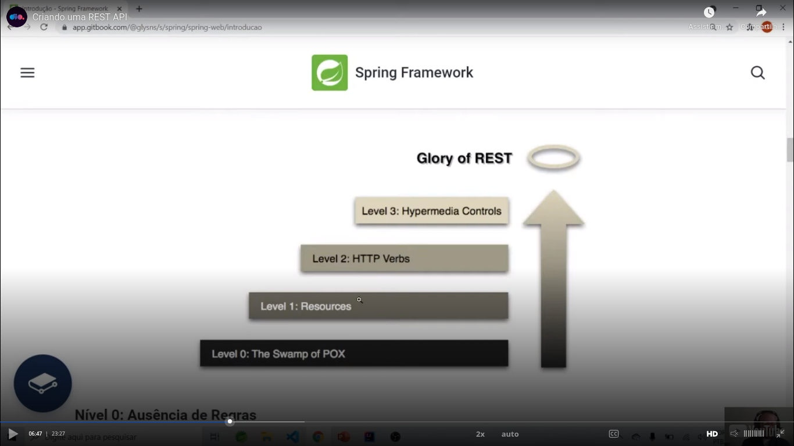
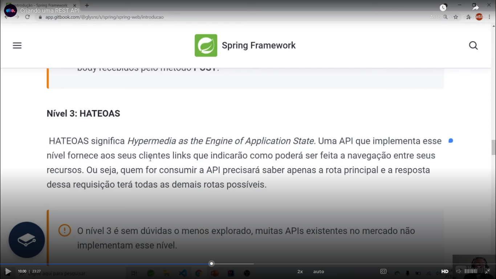
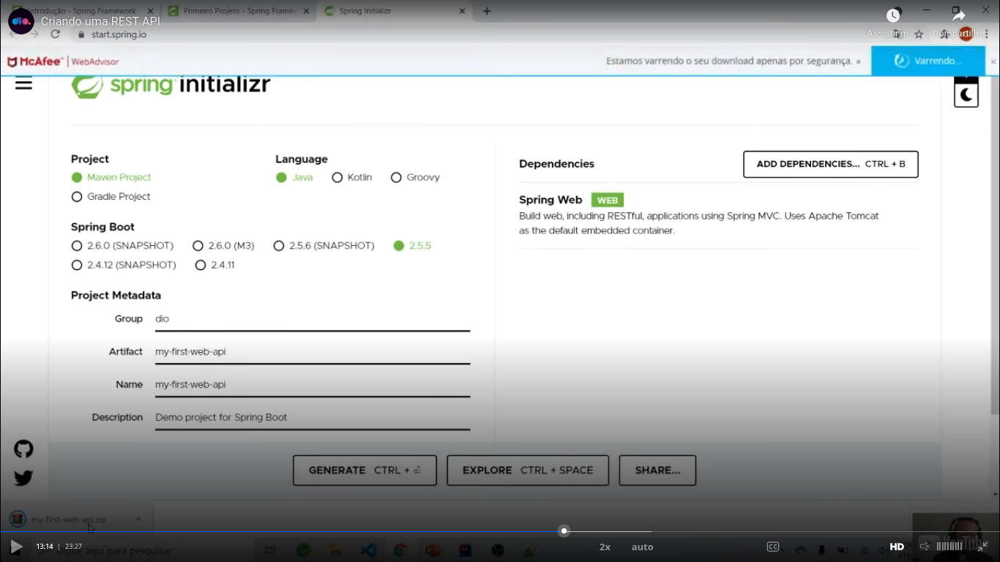

# Introduction

It exists as part of Spring Boot web:

- Spring web MVC;
- Rest API.

We will talk here of make a Spring REST API, but in the process we will talk about some parts like Spring Rest Controllers.

Teacher presented us `Glory of REST`, with some levels:



Teacher also talked about `HATEOAS`:



The starter of Spring REST API comes with a Tomcat listening on the port `8080`.

Teacher used a initializer of [this link](http://start.spring.io) with this configuration:



I generated a similar (Spring Initializr website changed a little) project. Please see the file `my-first-web-api.zip`and the directory `my-first-web-api-project-generated-with-initializr`, that is this zip file unpacked.


## Running the basic project

Run he basic project was not so easy.Then I generated [a video](https://youtu.be/jAd0SjAaUgQ) about this question.

The command to run the Spring application in terminal is (in the root directory of this repository):

```
cd my-first-web-api-project-generated-with-initializr/
mvn spring-boot:run
```

A comment: its necesary to wait only a few seconds. The terminal will not print new messages. You will can access the application in the address `http://127.0.0.1:8081`.

Another comment: I tried to stop the application and run again and it works!


## Rest controller

I made [this video](https://youtu.be/HM3XCLFhtEg) about the creation of a REST controller and a GET route.