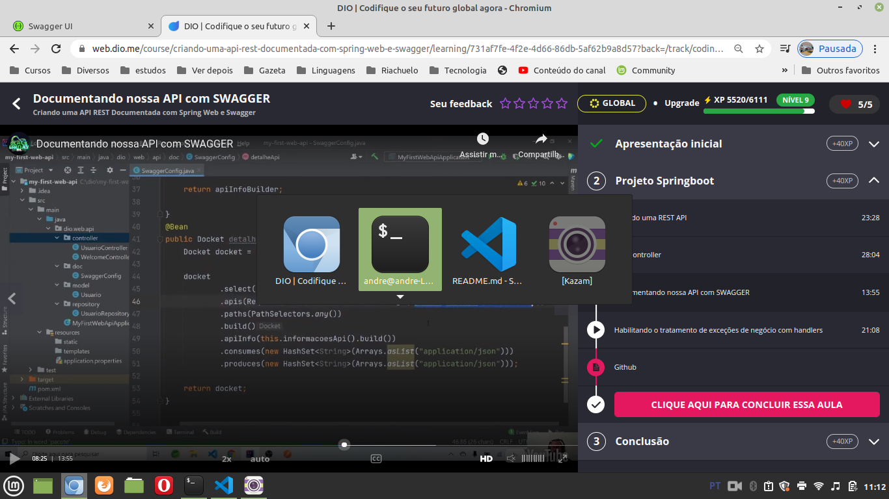

# Message

To be clear. The content here is a content based on a free course. Noone can reproduce this material. If you wanna to know this material, my advice is to you access the **free** [course](https://web.dio.me/track/coding-the-future-claro-java-spring-boot). And if they end the course or start to ask money to study in the course? Well, this considerations are out of my control, but the DIO material is excelent and the course is amazing! If you acquire a DIO paln, you will have access to amazing courses.

# Introduction

It exists as part of Spring Boot web:

- Spring web MVC;
- Rest API.

We will talk here of make a Spring REST API, but in the process we will talk about some parts like Spring Rest Controllers.

Teacher presented us `Glory of REST`, with some levels:


Teacher also talked about `HATEOAS`:


The starter of Spring REST API comes with a Tomcat listening on the port `8080`.

Teacher used a initializer of [this link](http://start.spring.io) with this configuration:


I generated a similar (Spring Initializr website changed a little) project. Please see the file `my-first-web-api.zip`and the directory `my-first-web-api-project-generated-with-initializr`, that is this zip file unpacked.


## Running the basic project

Run he basic project was not so easy.Then I generated [a video](https://youtu.be/jAd0SjAaUgQ) about this question.

The command to run the Spring application in terminal is (in the root directory of this repository):

```
cd my-first-web-api-project-generated-with-initializr/
mvn spring-boot:run
```

A comment: its necesary to wait only a few seconds. The terminal will not print new messages. You will can access the application in the address `http://127.0.0.1:8081`.

Another comment: I tried to stop the application and run again and it works!


## Rest controller

I made [this video](https://youtu.be/HM3XCLFhtEg) about the creation of a REST controller and a GET route.

Some useful annotations related to a REST controller:


Summary of the annotations:

- **@RestController**: annottion that defines that the controller is a REST controller;
- **@RequestMapping(prefix)**: as the methods that will receive REST requests will have this prefix;
- **@GetMapping, @PostMapping...**: related to some HTTP verbs;
- **@RequestBody**: related to a JSON body converted to a specific object;
- **@PathVariable**: related to a value of a variable receive through the URL of the request.

I made [this video](https://youtu.be/zP5PCH5asPQ) to explain the REST API that we created.

This is [the class](https://web.dio.me/course/criando-uma-api-rest-documentada-com-spring-web-e-swagger/learning/ce0b0876-dae5-49b8-986d-d1bc9781d96c?back=/track/coding-the-future-claro-java-spring-boot&tab=undefined&moduleId=undefined) that the teacher showed us this content.


## Swagger

I made [this video](https://youtu.be/UlXf0bZ4QKY) about the process of adding a Swagger configuration in the project.

[This StackOverflow answer](https://stackoverflow.com/a/77964227) provides me the dependency to include in `pom.xml` to avoid the problem of the modal in Swagger arguin me about the base URL. So we have 3 new dependencies in `pom.xml`. Two related to Swagger Fox and and another for this question.

In several tutorials in Internet it used "`Docket`". Who is Docket? Well, the tutorial aren't very clear about this question, but teacher showed us the import of Docket:


Some tutorials in Internet about adding a Swagger in a Spring application:

- [https://www.dio.me/articles/como-habilitar-o-swagger](https://www.dio.me/articles/como-habilitar-o-swagger);
- [https://www.treinaweb.com.br/blog/documentando-uma-api-spring-boot-com-o-swagger#google_vignette](https://www.treinaweb.com.br/blog/documentando-uma-api-spring-boot-com-o-swagger#google_vignette);
- [https://www.dio.me/articles/implementacao-basica-do-swagger-em-api-spring-boot](https://www.dio.me/articles/implementacao-basica-do-swagger-em-api-spring-boot).

[This](http://127.0.0.1:8081/swagger-ui/index.html) is the Swagger URL (or /swagger-ui.html).

In [this class](https://web.dio.me/course/criando-uma-api-rest-documentada-com-spring-web-e-swagger/learning/731af7fe-4f2e-4d66-86db-5af62b9a8d57?back=/track/coding-the-future-claro-java-spring-boot&tab=undefined&moduleId=undefined) teacher gives detailed information about personalize some things of Swagger in a configuration class.

To Swagger does not import with our business rules, model classes as example. It is concerned with the interface of the external world, in other words, the controllers. See how teacher limit the classes to be analyzed by Swagger to build the documentation:



If you want more detailed information, like how to personalize a contact information, please watch [the class](https://web.dio.me/course/criando-uma-api-rest-documentada-com-spring-web-e-swagger/learning/731af7fe-4f2e-4d66-86db-5af62b9a8d57?back=/track/coding-the-future-claro-java-spring-boot&tab=undefined&moduleId=undefined).

In the test of the creation of an user (please see the next image), teacher showed us how to personalize the parameters in the body of the request (through the big `textarea` in the image):

.

One comment: you can verify in the console in where in make the Spring application avaliable the request data received if you do a `System.out.println(information);`.

I inserted some methods with the necessary annotations to interact with some other HTTP verbs and do all the CRUD "tasks". The final controller class was:

```
package dio.my_first_web_api.controller;

import java.util.List;

import org.springframework.beans.factory.annotation.Autowired;
import org.springframework.web.bind.annotation.DeleteMapping;
import org.springframework.web.bind.annotation.GetMapping;
import org.springframework.web.bind.annotation.PathVariable;
import org.springframework.web.bind.annotation.PostMapping;
import org.springframework.web.bind.annotation.PutMapping;
import org.springframework.web.bind.annotation.RequestBody;
import org.springframework.web.bind.annotation.RequestMapping;
import org.springframework.web.bind.annotation.RequestParam;
import org.springframework.web.bind.annotation.RestController;

import dio.my_first_web_api.model.Usuario;
import dio.my_first_web_api.repository.UsuarioRepository;

@RestController
@RequestMapping("/usuarios")
public class UsuarioController {
    @Autowired
    private UsuarioRepository repository;

    public String getMethodName(@RequestParam String param) {
        return new String();
    }

    @GetMapping()
    public List<Usuario> obterUsuarios() {
        return repository.findAll();
    }

    @DeleteMapping("/{id}")
    public void delete(@PathVariable("id") Integer id) {
        repository.deleteById(id);
    }

    @PostMapping("/novo")
    public void adicionarUsuario(@RequestBody Usuario usuario) {
        System.out.println(usuario);
        System.out.println("adicionando um usuário");
    }

    @PutMapping("/edit")
    public void editarUsuario(@RequestBody Usuario usuario) {
        System.out.println(usuario);
        System.out.println("editando um usuário");
    }
}
```

I made [this video](https://youtu.be/xIFJCaW4Tc8) about using `exceptions` in a Spring application.

[This](https://github.com/digitalinnovationone/dio-springboot) is a Github repository related to the chapter.
